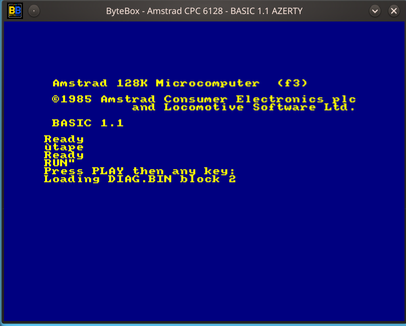
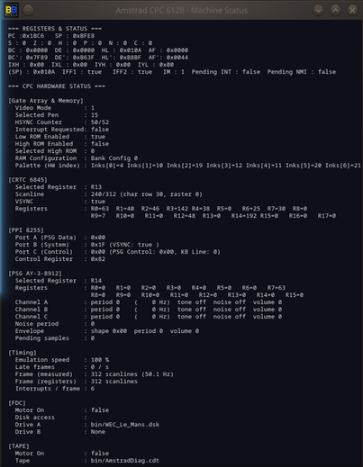

# ByteBox - an Amstrad CPC 6128 Emulator

## Command-line options

- `--diag` : additional diagnostics ROM (0F slot)
- `--disk=<file>` / `-d <file>`: load a disk image on drive A at startup. A bare
  filename (no path) is looked up in `[file] dsk_path` from `config.toml` if it
  isn't found as given.
- `--autocmd=<command>` / `-a <command>`: type a command at the emulated keyboard
  once BASIC is ready, exactly like Caprice32's own `--autocmd`. Handy for
  jumping straight into a game during a debugging session:

  ```sh
  cargo run -- --disk=Barbarian.dsk --autocmd='RUN"BARBA.I'
  ```

## Function keys

    F1 / F2 / F3   window size x1 / x2 / x3
    F4             toggle fullscreen
    F5             toggle the CRT shader (RGB phosphor mask, scanlines —
                   see below)
    F6             toggle the configuration/media panel (disks, tape,
                   drive B, extra RAM, zoom, volume, CRT shader tuning —
                   all with an immediate effect, no restart needed)
    F7             toggle the virtual keyboard (clickable, overlaid on the
                   emulator window)
    F8             step to next Z80 instruction
    F9             step to next video line
    F10            toggle the quick command bar (one input line, overlaid
                   on the emulator window)
    F11            toggle the full console window (scrollable history,
                   same commands as the quick command bar)
    F12            toggle the machine status window

The emulator no longer depends on the terminal it was launched from: every
command and every message goes through the quick command bar (`F10`) or the
full console window (`F11`), so launching from a desktop icon works exactly
like launching from a terminal.

This function key table, along with the "Emulator commands" and "Emulator
monitor commands" sections further down, are also available in-app, without
alt-tabbing to this file: the "Help" tab of the configuration panel (`F6`).

## CRT shader

`F5` reconstructs the image the way a real tube would: an RGB phosphor mask
(each screen pixel belongs to a red, green or blue column, staggered every
other row) plus a proper electron-beam profile (soft horizontal blending
between neighboring columns, a real dark gap between scanlines rather than
just a darkened pixel). The beam reconstruction is computed in source-pixel
space, so it keeps the same proportions at every zoom level; the phosphor
mask is sized in real output pixels (a property of the simulated tube, not
of the source image), so it stays visible at `x1` too, not just from `x2` up.

Scanlines follow the *real* CPC scanline period, not the frame buffer's:
`video::render` draws each CPC scanline twice (600 buffer rows = 300 real
scanlines), so one band per buffer row would draw twice as many as the
machine ever had, each half as tall.

Bright areas show weaker scanlines than dark ones, on purpose: a more
intense electron beam is physically wider, so it fills more of the gap. That
"beam bloom" is what keeps whites white without a global brightness multiply
— such a multiply clips the highlights while lifting the troughs, which
flattens the very scanline contrast it was meant to restore.

Horizontal edges are softened by an adjustable Gaussian beam spot: a real
CPC feeds the tube an analog signal of limited bandwidth, so nothing ever
ends on a hard edge *across* a line. Only across — each line is scanned
separately, which is why the vertical direction stays governed by the
scanline beam instead. At 0 the spot collapses onto the nearest texel and
you get the original sharp pixels back.

Every constant behind this effect — mask cell size, mask/scanline strength,
scanline beam width, beam bloom, brightness boost, horizontal blur — is a
slider in the "CRT Shader" tab of the configuration panel (`F6`), with
"Reset to defaults" and "Save to config.toml" buttons. It's a separate tab
from the rest of the panel (media, hardware, display, audio) because eight
sliders together no longer fit an `x1` window. The shipped defaults are tuned
for a high-density (4K) display; lower-DPI screens will likely want smaller
values.

Saving writes a `[crt]` section holding every slider's current value, and
only that section — the rest of your `config.toml`, comments included, is
left untouched, and saving twice replaces the section rather than stacking
a second one. Each field read back at startup overrides the corresponding
built-in default on its own, so a hand-written partial section is fine:

```toml
[crt]
scanline_beam = 9.0
mask_cell_px = 2.0
```

## Emulator commands
    disk d.dsk          Loads the d.dsk disk image on drive A
    disk d.dsk b        Loads the d.dsk disk image on drive B (if enabled in config.toml)
    disk eject          Ejects the disk image from drive A
    disk eject b        Ejects the disk image from drive B
    blank d.dsk         Creates a blank formatted disk image and inserts it in drive A
    blank d.dsk b       Creates a blank formatted disk image and inserts it in drive B
    tape f.cdt          Loads the f.cdt tape image into the tape reader
    tape eject          Ejects the tape image
    snap f.sna          Saves a .SNA snapshot (readable by other CPC emulators)
    pc                  Performs a power cycle
    vol                 Displays the audio output volume
    vol 30              Sets the audio output volume to 30 %
    driveb on           Enables drive B, with immediate effect (unlike
                        config.toml's [drives] drive_b, which only
                        applies at startup)
    driveb off          Disables drive B
    ram 16              Sets extra RAM banks to 16 (applied at the next
                        power cycle, "pc" — RAM is sized at construction)
    tapevol 10          Sets the tape signal level in the audio mix to 10 %
    diag on             Enables the Diagnostic ROM at slot 0F (applied at
                        the next power cycle, "pc")
    diag off            Disables it

All of the above are also available from the configuration/media panel
(**`F6`**) as clickable fields, with a native file picker for disk and tape
images — no need to type a path.

## Tape drive

The 6128 has a floppy drive, but the emulator also reproduces a real datacorder: loading `.cdt` images (see the
`tape` console command above, or `Machine::load_tape`), turning the motor on
and off from the PPI exactly as the firmware does, and even reinjecting the
tape signal into the audio mix while the motor runs, for the familiar
loading whistle. A power cycle (`pc`) keeps the tape inserted, rewound to
its start, just like switching a real CPC off and on again with a cassette
still in the deck.

At the BASIC prompt, **`CTRL` + the numeric keypad's `Enter`** (not the main
Enter key) types `RUN"` and validates it automatically — this is a keyboard
expansion token built into the firmware itself, not an emulator feature.
Once a tape is inserted, this is normally followed by "Press PLAY then any
key", after which the emulated datacorder starts feeding the firmware.


  
## Emulator monitor commands
  
    d 0x0000          disassembles code at 0x0000 and the 20 next
                      instructions
    m 0xeeee          displays memory content at address 0xeeee
    m 0xeeee 0xaa     sets memory address 0xeeee to the 0xaa value
    mr 0x1000         dumps 256 raw RAM bytes from 0x1000, ignoring any ROM
    mr 0x1000 0x1100  dumps the raw RAM range 0x1000..0x1100
    s 0xaa            searches for a byte in memory
    n                 steps to next Z80 instruction
    l                 steps to next video line
    j 0x0000          jumps to 0x0000 address
    b                 displays set breakpoints
    b 0x0002          sets a breakpoint at address 0x0002
    f 0x0002          "frees" (deletes) breakpoint at address 0x0002
    w                 displays set watchpoints
    w 0xeeee          adds a write watchpoint at address 0xeeee
    fw 0xeeee         removes watchpoint at address 0xeeee
    p                 pause execution
    g                 resume execution after the "p" command, or a breakpoint,
                      has been used to halt execution
    hw                displays Gate Array and CRTC status
    hw kb             keyboard test
    r                 displays the contents of flags, registers and interrupts
    t                 displays trace status
    t on              records every executed instruction in a ring buffer
    t calls           records only jumps, calls and returns (far longer reach)
    t off             stops recording, keeping what has been captured
    t dump 100        displays the last 100 recorded instructions
    t save f.txt      writes the whole buffer to a file
    
## Machine status window

A concrete example of combined usage:

1. launch the emulator.
2. open the machine status window alongside it using **`F12`**.
3. enter a breakpoint command in the quick command bar or the full console (e.g., `b 0x0038` for the interrupt) using **`F10`** or **`F11`**.
4. As soon as the breakpoint is hit, the emulator freezes, and the debug window displays the full machine state.
5. press **`F8`** several times: you see the disassembly print out in the console, and all register values ​​(PC, SP, A, B, C...) update in the debug window.
6. press **`F9`**: the emulator skips ahead by one video line, and you watch the `HSYNC Counter` and `current_line` update in real-time on the debugger screen.



## Development builds

Only a build made by the official packaging (PKGBUILD or equivalent) is
considered "official" — same principle as Caprice32. Anything else,
including a plain `cargo build --release` run by hand, shows a thick red
diagonal stripe across the window/taskbar icon, on all three windows
(main, console, machine status), so it's never mistaken for the packaged
release.

The distinction is made at compile time by the `BYTEBOX_PACKAGED_BUILD`
environment variable: if it's set (to anything) when `cargo build` runs,
the stripe is left off. Only the packaging recipe should ever set it —
for example:

```sh
BYTEBOX_PACKAGED_BUILD=1 cargo build --release
```

A plain `--release` build without that variable still gets the stripe:
`--release` alone doesn't mean "packaged", only the packaging step
setting this variable does.
